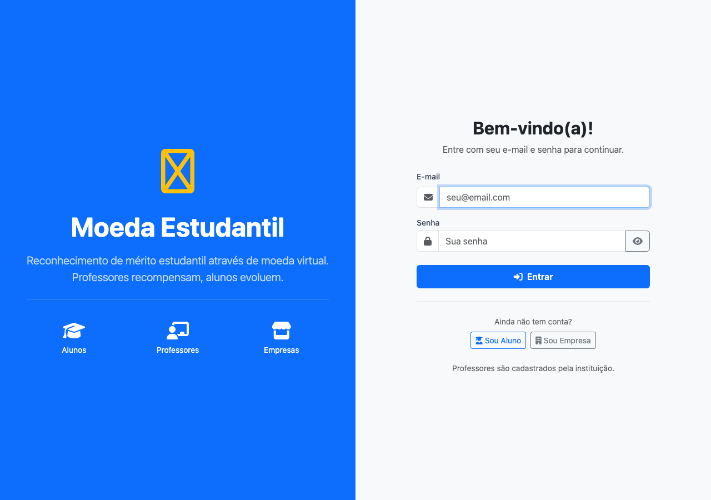
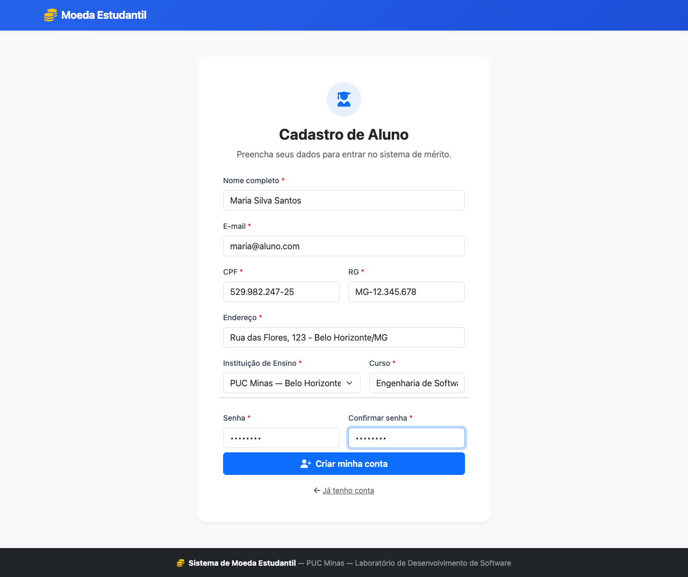
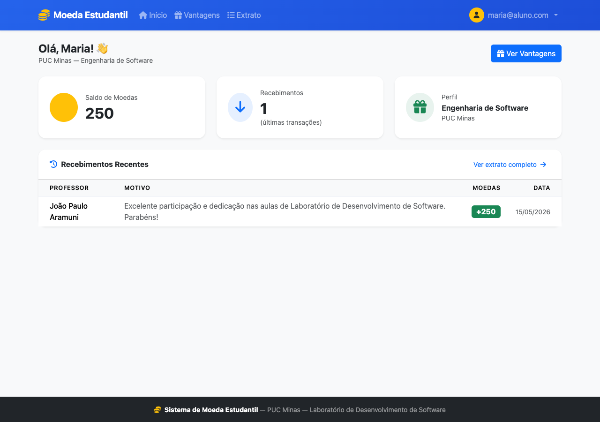
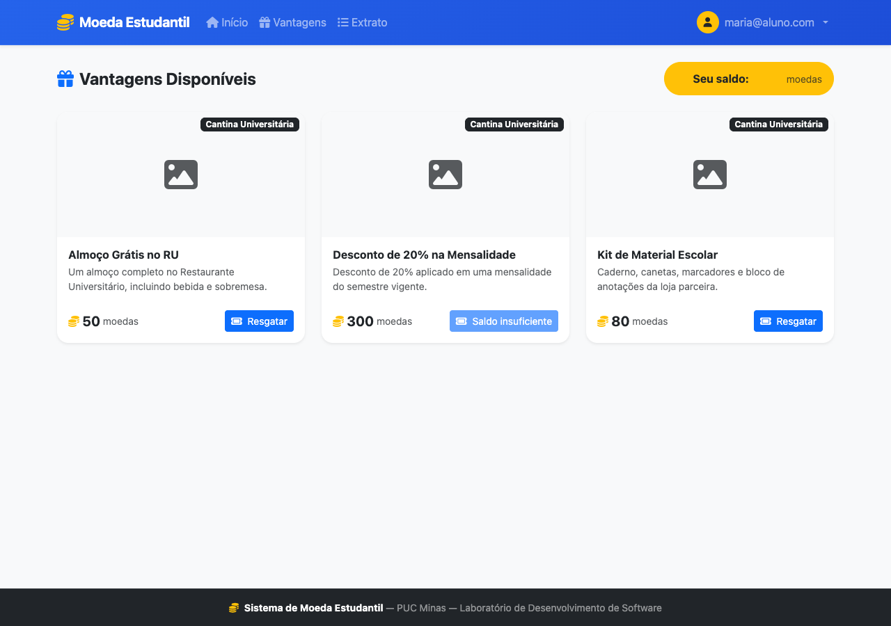
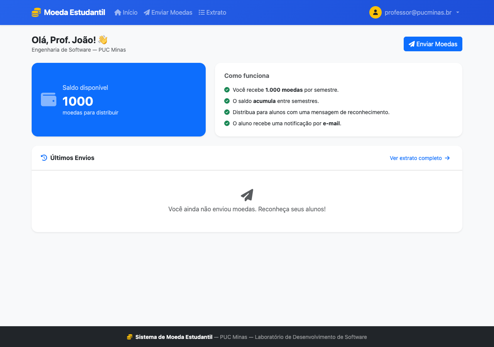
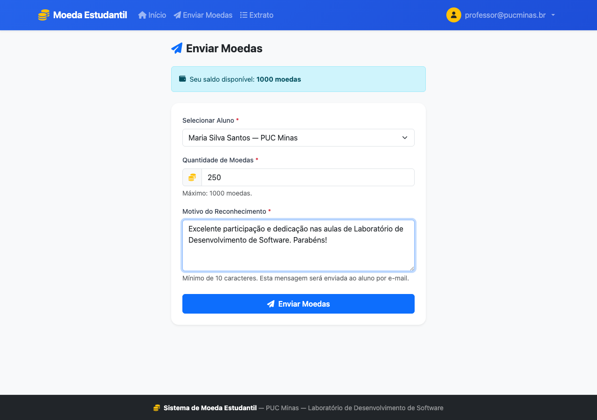
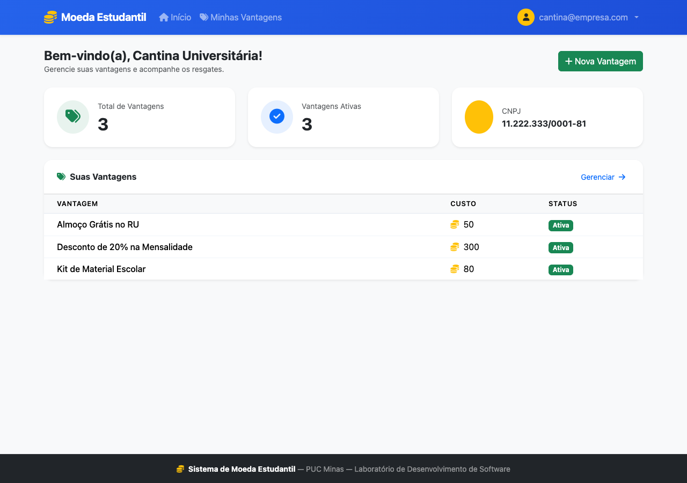
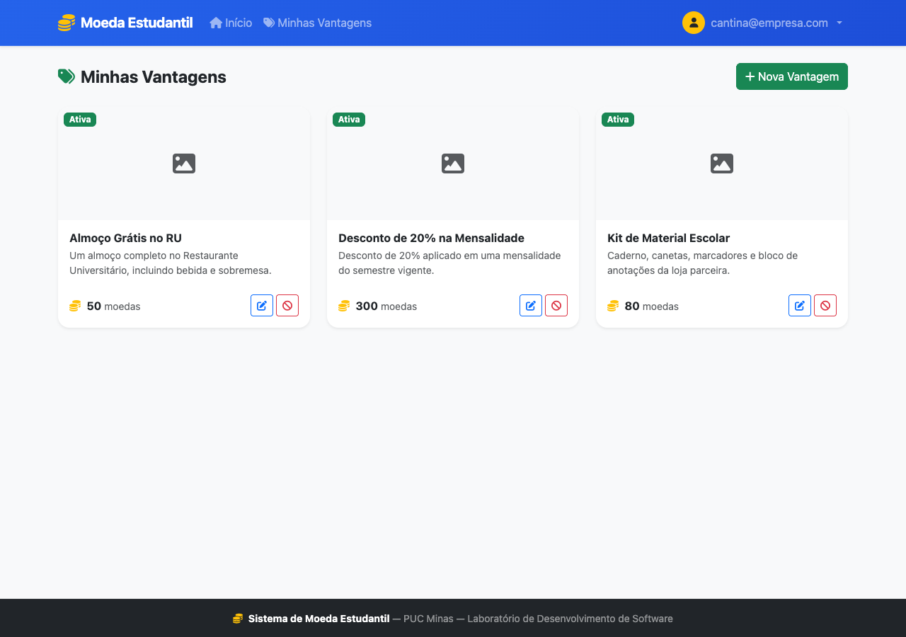

<a href="https://classroom.github.com/online_ide?assignment_repo_id=99999999&assignment_repo_type=AssignmentRepo"></a> <a href="https://classroom.github.com/open-in-codespaces?assignment_repo_id=99999999"></a>

---

# 🪙 Sistema de Moeda Estudantil

> [!NOTE]
> Sistema para **reconhecimento de mérito estudantil** via moeda virtual — professores distribuem moedas como recompensa e alunos as trocam por vantagens em empresas parceiras.
> Desenvolvido com **Java 21 + Spring Boot 3.5** seguindo a **Arquitetura MVC**.

<table>
  <tr>
    <td width="760px">
      <div align="justify">
        O <b>Sistema de Moeda Estudantil</b> é uma aplicação web desenvolvida para a disciplina de
        <i>Laboratório de Desenvolvimento de Software</i> da <b>PUC Minas — Engenharia de Software (4º Período)</b>.
        A plataforma permite que professores reconheçam o mérito de seus alunos distribuindo moedas virtuais,
        que podem ser trocadas por produtos e descontos em empresas parceiras cadastradas no sistema.
        O projeto aplica boas práticas de engenharia de software: <b>Arquitetura MVC</b>,
        <b>Spring Data JPA</b>, <b>Spring Security 6</b>, <b>herança JPA</b>,
        <b>notificações por e-mail</b> e <b>upload de imagens</b>.
      </div>
    </td>
    <td align="center" width="180px">
      
    </td>
  </tr>
</table>

---

## 🚧 Status do Projeto


---

## 📚 Sumário

- [Links Úteis](#-links-úteis)
- [Sobre o Projeto](#-sobre-o-projeto)
- [Funcionalidades](#-funcionalidades)
- [Tecnologias Utilizadas](#-tecnologias-utilizadas)
- [Arquitetura](#-arquitetura)
  - [Visão Geral das Camadas](#visão-geral-das-camadas)
  - [Diagramas UML](#diagramas-uml)
- [Instalação e Execução](#-instalação-e-execução)
  - [Pré-requisitos](#pré-requisitos)
  - [Como Executar](#-como-executar)
  - [Credenciais de Acesso](#credenciais-de-acesso)
  - [Execução com Docker Compose](#-execução-com-docker-compose)
- [Estrutura de Pastas](#-estrutura-de-pastas)
- [Demonstração](#-demonstração)
- [Testes](#-testes)
- [Documentação Utilizada](#-documentação-utilizada)
- [Autores](#-autores)
- [Agradecimentos](#-agradecimentos)
- [Licença](#-licença)

---

## 🔗 Links Úteis

* 🌐 **Aplicação:** [`http://localhost:8080`](http://localhost:8080) *(disponível com a aplicação rodando)*
* 🩺 **Login:** [`http://localhost:8080/auth/login`](http://localhost:8080/auth/login)
* 📐 **Casos de Uso:** [`docs/sprint1/casos-de-uso/v1/`](docs/sprint1/casos-de-uso/v1/)
* 📐 **Diagrama de Classes:** [`docs/sprint1/diagrama-classes/v1/`](docs/sprint1/diagrama-classes/v1/)
* 📐 **Diagrama de Componentes:** [`docs/sprint1/diagrama-componentes/v1/`](docs/sprint1/diagrama-componentes/v1/)
* 📋 **Modelo ER:** [`docs/sprint2/modelo-er/v1/`](docs/sprint2/modelo-er/v1/)
* 🎞️ **Apresentação Sprint 3:** [`docs/sprint3/apresentacao/Sprint 3 - Arquitetura e Persistencia.pptx`](docs/sprint3/apresentacao/Sprint%203%20-%20Arquitetura%20e%20Persistencia.pptx)
* 📖 **User Stories:** [`docs/sprint1/user-stories.md`](docs/sprint1/user-stories.md)

---

## 📝 Sobre o Projeto

O **Sistema de Moeda Estudantil** foi desenvolvido como projeto integrador do curso de **Engenharia de Software — PUC Minas**, com o objetivo de estimular o reconhecimento do mérito estudantil por meio de uma moeda virtual.

**Por que existe?**
O reconhecimento do esforço e da participação dos alunos costuma ser informal e sem rastreabilidade. O sistema centraliza esse processo: professores distribuem moedas com mensagens de reconhecimento e alunos trocam por benefícios reais em empresas parceiras.

**O que resolve?**
- Reconhecimento formal e rastreável do mérito estudantil
- Incentivo à participação ativa nas aulas
- Parceria entre instituição de ensino e empresas locais
- Notificações automáticas por e-mail em todas as transações

**Contexto:**
Projeto acadêmico desenvolvido ao longo de 3 sprints aplicando metodologias ágeis, modelagem UML e boas práticas de Arquitetura MVC com Spring Boot.

---

## ✨ Funcionalidades

### 🎓 Aluno
- Cadastro com nome, e-mail, CPF, RG, endereço, instituição e curso
- Dashboard com saldo de moedas e recebimentos recentes
- Extrato completo (recebimentos de professores + resgates realizados)
- Catálogo de vantagens com foto, descrição e custo em moedas
- Resgate de vantagens com geração de código de cupom único
- Recebimento de cupom por e-mail ao resgatar
- Edição de perfil

### 👨‍🏫 Professor
- Login pré-cadastrado pela instituição de ensino
- Recebimento de **1.000 moedas por semestre** (acumulativo)
- Envio de moedas para alunos com mensagem de reconhecimento obrigatória
- Dashboard com saldo e últimos envios
- Extrato completo de todas as distribuições realizadas

### 🏢 Empresa Parceira
- Cadastro com nome fantasia e CNPJ
- CRUD completo de vantagens (nome, descrição, foto, custo em moedas)
- Dashboard com estatísticas das vantagens cadastradas
- Notificação por e-mail ao receber um resgate (com código de confirmação)

---

## 🛠 Tecnologias Utilizadas

| Tecnologia | Versão | Finalidade |
|---|---|---|
| Java | 21 | Linguagem principal |
| Spring Boot | 3.5 | Framework principal |
| Spring MVC | — | Camada Controller (MVC) |
| Thymeleaf | 3.x | Template engine (View) |
| Spring Data JPA | — | Repositórios e ORM |
| Hibernate | 6.x | Implementação JPA |
| Spring Security | 6.x | Autenticação e autorização por roles |
| Spring Mail | — | Envio de e-mails (JavaMailSender) |
| Bean Validation | 3.x | Validação de formulários |
| PostgreSQL | 16 | Banco de dados relacional |
| Docker Compose | — | Container do banco de dados |
| Lombok | — | Redução de boilerplate |
| Bootstrap | 5.3 | Estilização e componentes UI |
| Font Awesome | 6.x | Ícones |
| Maven | 3.9 | Build tool |

---

## 🏗 Arquitetura

O projeto segue a **Arquitetura MVC (Model-View-Controller)** com camada de serviços.

### Visão Geral das Camadas

```
[Browser]
    ↓  HTTP GET/POST (form submit)
[Controller]       — Recebe requisição, chama Service, retorna View
    ↓
[Service]          — Regras de negócio, validações, orquestração
    ↓
[Repository]       — Acesso a dados via Spring Data JPA
    ↓
[Model/Entity]     — Entidades JPA mapeadas para tabelas
    ↓
[PostgreSQL 16]    — Banco de dados relacional

              ↑ View (Thymeleaf)
              — Templates HTML renderizados no servidor com dados do Model
```

**Pacotes da aplicação:**

| Pacote | Responsabilidade |
|---|---|
| `controller/` | Endpoints MVC — recebe requisições HTTP e retorna views |
| `dto/` | Data Transfer Objects — desacoplam formulários das entidades JPA |
| `service/` | Lógica de negócio — validações, transferência de moedas, envio de e-mail |
| `repository/` | Interfaces Spring Data JPA — camada de acesso a dados (DAO) |
| `model/` | Entidades JPA — mapeamento ORM das tabelas |
| `model/enums/` | Enumerações do domínio (`TipoUsuario`, `TipoTransacao`) |
| `exception/` | Exceções customizadas do domínio (`SaldoInsuficiente`, `UsuarioNaoEncontrado`, etc.) |
| `handler/` | `GlobalExceptionHandler` — captura exceções globalmente via `@ControllerAdvice` |
| `mapper/` | Conversão entre Entidade ↔ DTO (`AlunoMapper`, `VantagemMapper`) |
| `event/` | Eventos Spring (`MoedasEnviadasEvent`, `VantagemResgatadaEvent`) |
| `security/` | `SecurityUtils` — utilitário para obter usuário autenticado do contexto |
| `util/` | Utilitários — formatação/validação de CPF/CNPJ, geração de cupom |
| `constant/` | `AppConstants` — constantes globais (rotas, roles, diretórios) |
| `config/` | Configurações Spring — Security, Web, DataInitializer |

**Estratégia de herança JPA:**

| Entidade | Estratégia | Justificativa |
|---|---|---|
| `Usuario` → `Aluno`, `Professor`, `EmpresaParceira` | JOINED | Subtipos têm campos muito distintos; evita colunas nulas |
| `Transacao` → `TransacaoEnvio`, `TransacaoResgate` | SINGLE_TABLE | Campos específicos são poucos; evita JOINs no extrato |

### Diagramas UML

| Diagrama | Fonte PlantUML | Preview |
|---|---|---|
| Casos de Uso | [`docs/sprint1/casos-de-uso/v1/casos-de-uso.puml`](docs/sprint1/casos-de-uso/v1/casos-de-uso.puml) | [`casos-de-uso.png`](docs/sprint1/casos-de-uso/v1/Casos%20de%20Uso%20-%20Sistema%20de%20Moeda%20Estudantil.png) |
| Diagrama de Classes | [`docs/sprint1/diagrama-classes/v1/diagrama-classes.puml`](docs/sprint1/diagrama-classes/v1/diagrama-classes.puml) | [`diagrama-classes.png`](docs/sprint1/diagrama-classes/v1/Diagrama%20de%20Classes%20-%20Sistema%20de%20Moeda%20Estudantil.png) |
| Diagrama de Componentes | [`docs/sprint1/diagrama-componentes/v1/diagrama-componentes.puml`](docs/sprint1/diagrama-componentes/v1/diagrama-componentes.puml) | [`diagrama-componentes.png`](docs/sprint1/diagrama-componentes/v1/Diagrama%20de%20Componentes%20-%20Sistema%20de%20Moeda%20Estudantil.png) |
| Modelo ER | [`docs/sprint2/modelo-er/v1/modelo-er.puml`](docs/sprint2/modelo-er/v1/modelo-er.puml) | [`modelo-er.png`](docs/sprint2/modelo-er/v1/Modelo%20ER%20-%20Sistema%20de%20Moeda%20Estudantil.png) |

> Para editar os arquivos `.puml`, instale o plugin **PlantUML** no VS Code e pressione `Alt+D` para preview ao vivo.
> As imagens `.png` foram geradas automaticamente via `plantuml -tpng`.

---

## 🔧 Instalação e Execução

### Pré-requisitos

| Ferramenta | Versão mínima | Verificar com |
|---|---|---|
| Java JDK | 21 | `java --version` |
| Maven | 3.9 | `mvn --version` |
| Docker Desktop | Qualquer | Interface gráfica |
| Git | Qualquer | `git --version` |

---

### ⚡ Como Executar

#### 1. Subir o banco de dados (PostgreSQL via Docker)

```bash
docker compose up -d
```

Isso cria o container PostgreSQL com o banco `moeda_estudantil` na porta `5432`.

#### 2. Executar a aplicação

```bash
./mvnw spring-boot:run
```

Acesse: **[http://localhost:8080](http://localhost:8080)**

---

### Credenciais de Acesso

| Perfil | E-mail | Senha | Como acessar |
|---|---|---|---|
| Professor | `professor@pucminas.br` | `professor123` | Pré-cadastrado (seed) |
| Aluno | cadastre em `/auth/cadastro-aluno` | — | Auto-cadastro |
| Empresa | cadastre em `/auth/cadastro-empresa` | — | Auto-cadastro |

O **DataInitializer** povoa automaticamente:
- **5 instituições:** PUC Minas, UFMG, UFOP, UFSJ, CEFET-MG
- **1 professor padrão** vinculado à PUC Minas com 1.000 moedas

---

### 🐳 Execução com Docker Compose

```bash
# Subir apenas o banco:
docker compose up -d

# Verificar containers:
docker ps

# Encerrar:
docker compose down
```

---

## 📂 Estrutura de Pastas

```
sistema-moeda-estudantil/
├── docker-compose.yml              # PostgreSQL 16
├── pom.xml                         # Dependências Maven
├── mvnw / mvnw.cmd                 # Maven Wrapper
│
├── src/main/java/com/pucminas/moedaestudantil/
│   ├── MoedaEstudantilApplication.java
│   │
│   ├── config/                     # Configurações Spring
│   │   ├── SecurityConfig.java     # Autenticação, autorização, redirect pós-login
│   │   ├── DataInitializer.java    # Seed: instituições + professor padrão
│   │   └── WebConfig.java          # Handler de arquivos estáticos (/uploads)
│   │
│   ├── constant/                   # Constantes globais
│   │   └── AppConstants.java       # Rotas, roles, diretórios, limites
│   │
│   ├── controller/                 # Camada MVC — endpoints HTTP
│   │   ├── AuthController.java     # /auth/** — login, cadastro de aluno e empresa
│   │   ├── AlunoController.java    # /aluno/** — dashboard, extrato, vantagens, resgate, perfil
│   │   ├── ProfessorController.java # /professor/** — dashboard, enviar-moedas, extrato
│   │   └── EmpresaParceiraController.java # /empresa/** — dashboard, CRUD vantagens, perfil
│   │
│   ├── dto/                        # Data Transfer Objects — desacoplam forms das entidades
│   │   ├── CadastroAlunoDTO.java
│   │   ├── CadastroEmpresaDTO.java
│   │   ├── EnviarMoedasDTO.java
│   │   ├── VantagemDTO.java
│   │   ├── AlunoDashboardDTO.java
│   │   ├── ProfessorDashboardDTO.java
│   │   └── EmpresaDashboardDTO.java
│   │
│   ├── event/                      # Eventos Spring (desacoplamento de notificações)
│   │   ├── MoedasEnviadasEvent.java
│   │   └── VantagemResgatadaEvent.java
│   │
│   ├── exception/                  # Exceções customizadas do domínio
│   │   ├── SaldoInsuficienteException.java
│   │   ├── UsuarioNaoEncontradoException.java
│   │   ├── VantagemNaoEncontradaException.java
│   │   ├── VantagemInativaException.java
│   │   ├── EmailJaCadastradoException.java
│   │   └── CpfCnpjJaCadastradoException.java
│   │
│   ├── handler/                    # Tratamento global de exceções
│   │   └── GlobalExceptionHandler.java  # @ControllerAdvice
│   │
│   ├── mapper/                     # Conversão Entidade ↔ DTO
│   │   ├── AlunoMapper.java
│   │   └── VantagemMapper.java
│   │
│   ├── model/                      # Entidades JPA — mapeamento ORM
│   │   ├── enums/
│   │   │   ├── TipoUsuario.java    # ALUNO · PROFESSOR · EMPRESA
│   │   │   └── TipoTransacao.java  # ENVIO · RESGATE
│   │   ├── Usuario.java            # Entidade base (JOINED inheritance)
│   │   ├── Aluno.java
│   │   ├── Professor.java
│   │   ├── EmpresaParceira.java
│   │   ├── Instituicao.java
│   │   ├── Vantagem.java
│   │   ├── Transacao.java          # Entidade base (SINGLE_TABLE inheritance)
│   │   ├── TransacaoEnvio.java     # Professor → Aluno
│   │   └── TransacaoResgate.java   # Aluno → Vantagem (com código de cupom)
│   │
│   ├── repository/                 # Camada DAO — Spring Data JPA
│   │   ├── UsuarioRepository.java
│   │   ├── AlunoRepository.java
│   │   ├── ProfessorRepository.java
│   │   ├── EmpresaParceiraRepository.java
│   │   ├── InstituicaoRepository.java
│   │   ├── VantagemRepository.java
│   │   ├── TransacaoEnvioRepository.java
│   │   └── TransacaoResgateRepository.java
│   │
│   ├── security/                   # Utilitários de segurança
│   │   └── SecurityUtils.java      # Acesso ao usuário autenticado via SecurityContext
│   │
│   ├── service/                    # Camada de negócio
│   │   ├── UserDetailsServiceImpl.java  # Spring Security — carrega usuário por e-mail
│   │   ├── AlunoService.java
│   │   ├── ProfessorService.java
│   │   ├── EmpresaParceiraService.java
│   │   ├── VantagemService.java
│   │   ├── TransacaoService.java        # Distribuição de moedas + resgate de vantagens
│   │   └── EmailService.java            # Notificações por e-mail (configurável)
│   │
│   └── util/                       # Utilitários técnicos
│       ├── CpfCnpjUtils.java       # Formatação e validação de CPF/CNPJ
│       └── MoedaUtils.java         # Formatação de saldo + geração de cupom
│
├── src/main/resources/
│   ├── application.properties
│   ├── templates/
│   │   ├── fragments/              # navbar, head, footer (reutilizáveis)
│   │   ├── auth/                   # login, cadastro-aluno, cadastro-empresa
│   │   ├── aluno/                  # dashboard, extrato, vantagens, perfil
│   │   ├── professor/              # dashboard, enviar-moedas, extrato
│   │   ├── empresa/                # dashboard, vantagens, nova/editar-vantagem, perfil
│   │   └── error/                  # páginas de erro (generico.html)
│   └── static/
│       ├── css/style.css
│       └── js/main.js
│
├── docs/
│   ├── sprint1/
│   │   ├── casos-de-uso/
│   │   │   └── v1/                 # casos-de-uso.puml + .png
│   │   ├── diagrama-classes/
│   │   │   └── v1/                 # diagrama-classes.puml + .png
│   │   ├── diagrama-componentes/
│   │   │   └── v1/                 # diagrama-componentes.puml + .png
│   │   └── user-stories.md
│   └── sprint2/
│       └── modelo-er/
│           └── v1/                 # modelo-er.puml + .png
│
└── uploads/                        # Fotos de vantagens (gerado em runtime)
```

---

## 🎥 Demonstração

| Tela | Screenshot |
|:---:|:---:|
| **Login** | **Cadastro de Aluno** |
|  |  |
| **Dashboard do Aluno** | **Catálogo de Vantagens** |
|  |  |
| **Dashboard do Professor** | **Enviar Moedas** |
|  |  |
| **Dashboard da Empresa** | **Gerenciar Vantagens** |
|  |  |

---

## 🧪 Testes

```bash
./mvnw test
```

### Progresso das Sprints

| Sprint | Entregável | Status |
|---|---|---|
| Lab03S01 | Casos de Uso, User Stories, Diagrama de Classes, Diagrama de Componentes | ✅ Concluído |
| Lab03S02 | Modelo ER, estratégia ORM (JPA/Hibernate), CRUDs iniciais de aluno e empresa | 🔄 Em andamento |
| Lab03S03 | CRUDs finais, integração completa, apresentação da arquitetura | ⏳ Pendente |

---

## 🔗 Documentação Utilizada

* 📖 [Spring Boot Reference Documentation](https://docs.spring.io/spring-boot/docs/current/reference/html/)
* 📖 [Spring Data JPA](https://docs.spring.io/spring-data/jpa/reference/jpa.html)
* 📖 [Spring Security Reference](https://docs.spring.io/spring-security/reference/)
* 📖 [Thymeleaf Documentation](https://www.thymeleaf.org/documentation.html)
* 📖 [Hibernate ORM Documentation](https://hibernate.org/orm/documentation/)
* 📖 [Bootstrap 5 Documentation](https://getbootstrap.com/docs/5.3/)
* 📖 [PlantUML Language Reference](https://plantuml.com/guide)
* 📖 [Docker Compose Reference](https://docs.docker.com/compose/)
* 📖 [Conventional Commits](https://www.conventionalcommits.org/en/v1.0.0/)

---

## 👥 Autores

| 👤 Nome | 🖼️ Foto | :octocat: GitHub | 💼 LinkedIn |
|---|---|---|---|
| Gustavo Pessoa Firmino Duarte | <div align="center"></div> | <div align="center"><a href="https://github.com/gustavofirmino"></a></div> | <div align="center"><a href="https://www.linkedin.com/in/gustavofirmino"></a></div> |

> **PUC Minas — Engenharia de Software — 4º Período**  
> Laboratório de Desenvolvimento de Software

---

## 🙏 Agradecimentos

* [**PUC Minas — Engenharia de Software**](https://www.pucminas.br/) — Pelo suporte institucional e estrutura acadêmica.
* [**Prof. Dr. João Paulo Aramuni**](https://github.com/joaopauloaramuni) — Pelas orientações em Arquitetura de Software, Design Patterns e boas práticas de desenvolvimento.
* [**Spring Framework**](https://spring.io/) — Por um ecossistema robusto e bem documentado para desenvolvimento Java.
* [**Bootstrap**](https://getbootstrap.com/) — Pelo design system responsivo e componentes prontos para uso.

---

## 📄 Licença

Este projeto está distribuído sob a licença **MIT**.  
Consulte o arquivo [`LICENSE`](LICENSE) para mais detalhes.

---

<div align="center">
  <sub>Desenvolvido com ☕ Java + 🌿 Spring Boot — PUC Minas, 2026</sub>
</div>
